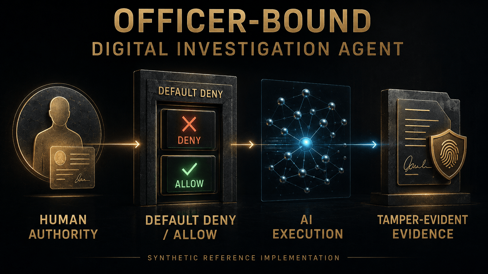
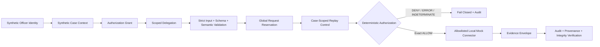

# Officer-Bound Digital Investigation Agent (OBDIA)

[](https://github.com/a-bonfim-tech/officer-bound-digital-investigation-agent/actions/workflows/bounded-reference-slice.yml)


An independent cybersecurity research and engineering project exploring a **human-accountable architecture for officer-bound AI agents supporting authorized digital investigations**.

<p align="center">
  
</p>

> **Current status:** a tested, bounded, synthetic reference slice is implemented and merged. It is a non-production security reference implementation, not an operational law-enforcement system, not a production-ready investigative platform, and not an AI system with independent legal authority.

## Why OBDIA exists

AI agents can call tools, process untrusted content and act across complex environments. In an investigative context, that creates a critical security question: **how do you ensure that technical capability never becomes independent authority?**

OBDIA explores one answer: bind every permitted action to an accountable human officer, an authorized case, a declared scope, a validity interval and an allowlisted connector capability — then fail closed whenever any required condition is missing, mismatched, stale, revoked, malformed or indeterminate.

The governing invariant is:

```text
NO TOOL OR CONNECTOR EXECUTION BEFORE A VALID POSITIVE AUTHORIZATION DECISION
```

## Reference-slice architecture



The slice is intentionally local, isolated, synthetic-data-only and mock-only. Live investigative infrastructure, real case data, production credentials and autonomous legal authority are outside this release scope.

## What is implemented

The current bounded implementation includes:

- strict raw-byte, UTF-8, duplicate-key and JSON grammar validation;
- governed schema and semantic validation for the retained data contracts;
- deterministic canonicalization and domain-separated SHA-256 integrity material;
- global request-ID reservation and case-scoped replay controls;
- deterministic injected time and authorization evaluation;
- officer, case, scope, delegation and connector-capability binding;
- default-deny behavior with `ERROR`/`INDETERMINATE` mapped to denial;
- an allowlisted **local mock connector** that is unreachable before exact `ALLOW`;
- connector-result validation;
- evidence, audit and provenance records;
- rollback/containment behavior for the bounded slice;
- an offline verifier under `cmd/verify`;
- CI, fuzzing, vulnerability analysis, static security analysis, secret scanning and SBOM generation.

## Verification evidence

The retained bounded evidence records:

| Control | Result |
|---|---|
| Go toolchain | `go1.26.5` |
| Formatting | PASS |
| `go vet` | PASS |
| `go test` | PASS |
| Acceptance criteria | AC01–AC20 PASS |
| Bounded fuzzing | PASS |
| govulncheck | 0 called findings |
| gosec | 0 unsuppressed findings; bounded suppressions documented |
| TruffleHog | 0 verified / 0 unverified secrets |
| SBOM | CycloneDX 1.6 |
| Third-party runtime dependencies | 0 |
| Third-party test dependencies | 0 |
| GitHub Actions CI | PASS on the validated implementation tree |

Canonical evidence is retained in [`docs/evidence/reference-slice/evidence-manifest.json`](docs/evidence/reference-slice/evidence-manifest.json).

The supplemental Codex Security Deep Security Scan is **not** represented as PASS or no-findings evidence: its final attempt did not complete because of an external usage-limit condition and produced no canonical `report.md`.

## 60-second local verification

Prerequisite: **Go 1.26.5**.

```bash
git clone https://github.com/a-bonfim-tech/officer-bound-digital-investigation-agent.git
cd officer-bound-digital-investigation-agent
go run ./cmd/verify all
```

`cmd/verify` uses the Go toolchain from one absolute `GOROOT` and runs formatting verification, `go vet` and the deterministic test suite with module/network resolution disabled for the verification phase.

For the complete CI security-control path, see [`.github/workflows/bounded-reference-slice.yml`](.github/workflows/bounded-reference-slice.yml).

## Repository map

- [`adr/`](adr/) — architecture decision records for the bounded slice.
- [`internal/referenceslice/`](internal/referenceslice/) — Go implementation and tests.
- [`schemas/reference-slice/`](schemas/reference-slice/) — governed security-data contract schema.
- [`testdata/`](testdata/) — retained canonical vectors and synthetic fixture governance artifacts.
- [`cmd/verify/`](cmd/verify/) — one-command local verification interface.
- [`docs/governance/`](docs/governance/) — accountable-human decisions, entry gates and retained governance records.
- [`docs/architecture/`](docs/architecture/) — threat-model and architecture review material.
- [`docs/evidence/reference-slice/`](docs/evidence/reference-slice/) — bounded technical evidence and SBOM.
- [`docs/knowledge/`](docs/knowledge/) — project governance, trust, research, implementation and publication policies.

## Security and trust boundaries

OBDIA is designed around **human accountability**, not agent autonomy. The bounded reference slice does not authorize or claim:

- real-person investigation;
- real case processing;
- production credentials or secrets;
- live law-enforcement connectors;
- live Dark Web/Tor investigation;
- uncontrolled scraping or external investigative APIs;
- real wallets, private keys or blockchain transactions;
- production deployment;
- independent AI legal or investigative authority.

See [`SECURITY.md`](SECURITY.md) for vulnerability reporting and the project's defensive security scope.

## Governance and reviewability

The repository intentionally separates:

1. architecture acceptance;
2. technology/toolchain selection;
3. implementation authorization;
4. implementation evidence;
5. security/privacy review;
6. risk disposition;
7. release/publication claims.

This separation is deliberate: **documentation, model output or connector output cannot create human authority.**

Start with:

- [`adr/ADR-0001-synthetic-officer-bound-reference-slice.md`](adr/ADR-0001-synthetic-officer-bound-reference-slice.md)
- [`docs/governance/decisions/`](docs/governance/decisions/)
- [`docs/architecture/reference-slice/SYNTHETIC_OFFICER_BOUND_REFERENCE_SLICE_THREAT_MODEL_APPLICABILITY_REVIEW.md`](docs/architecture/reference-slice/SYNTHETIC_OFFICER_BOUND_REFERENCE_SLICE_THREAT_MODEL_APPLICABILITY_REVIEW.md)
- [`docs/evidence/reference-slice/evidence-manifest.json`](docs/evidence/reference-slice/evidence-manifest.json)

## Responsible use

This project is intended for cybersecurity research, defensive architecture, AI-security engineering and controlled proof-of-concept work. It must not be represented as an official police system, an independently certified security product, a production investigative platform or evidence of institutional endorsement.

## License

Licensed under the [Apache License 2.0](LICENSE). See [`NOTICE`](NOTICE) for project attribution.
